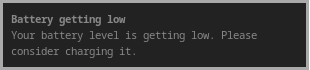
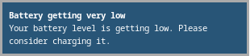
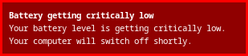

# Simple Battery Warning (sbw)

The goal of this project is to warn users about low levels of battery when using i3wm.

When the battery fails below given levels (by default 30%, 20%, and 5%), the notficiation will be displayed on
the screen as shown below:





## Runtime dependencies

To run this program, you need to have `dbus library` installed (libdbus-1-3 on Debian 12).

## Installation

You can download the latest release for releases. Next, copy the program to `/usr/bin`.
If you'd like, you can install the program using makefile - have a look and the `Building using the local environment`
section in this manual.

## Usage

### Test

To test, if program is working correctly (there are no dependencies missing) just `cd` to folder with binary and run `./sbw`.
If there are no errors you are good to go.

### Adding to i3

Add the following line to your `i3` config file:

```
exec --no-startup-id sbw
```

## Building project

### Building using the local environment

To build this project, you need the following programs/libraries:

* gcc
* make
* pkg-config
* dbus library (libdbus-1-dev on Debian)

After installing those dependencies, you should run the following command:

```bash
make build
```

To install `sbw` only for you:

```bash
make install
```

The program will be installed into `~/.local/bin/sbw` - please add this path to your `PATH`.

To install `sbw` for all users, run the following:

```bash
sudo make global_install
```

The program will be installed into `/usr/bin`.

## Changing configuration

Currently, `sbw` does not support any config file or runtime parameters. To change the configuration, you
have to edit the `config.h` file. You can modify the following parameters:

* `CHECK_INTERVAL` (default value 60) - how often to check for battery level in seconds,
* `CRITICAL_BAT_LEVEL` (default value 5) - battery level on which the information of critical battery level will be sent,
* `WARN_BAT_LEVEL` (default value 20) - battery level on which the information of low battery level will be sent,
* `INFORM_BAT_LEVEL` (default value 30) - battery level on which the information of decreasing battery level will be sent,
* `CRITICAL_BAT_LEVEL_INFO_TIMEOUT_SEC` (default value 600) - for how long the critical battery level should be displayed to a user in seconds,
* `WARN_BAT_LEVEL_INFO_TIMEOUT_SEC` (default value 60) - for how long the low battery level should be displayed to a user in seconds,
* `INFORM_BAT_LEVEL_INFO_TIMEOUT_SEC` (default value 20) - for how long the decreasing battery level should be displayed to a user in seconds.

After changing configuration, you have to rebuild and reinstall `sbw`.
